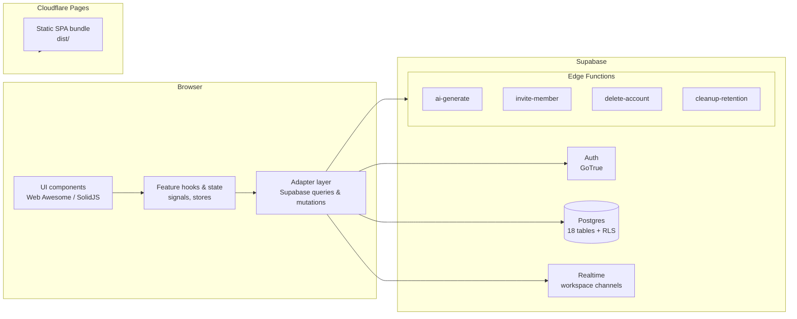
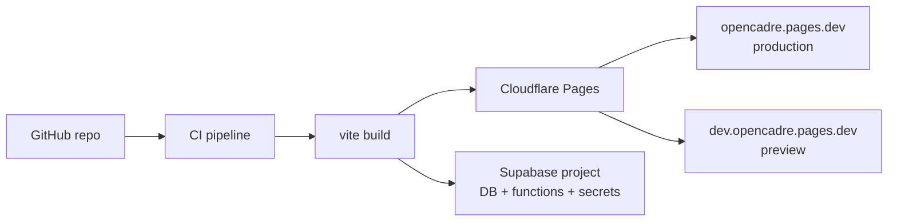

# OpenCadre — Architecture

This document describes the technical architecture of OpenCadre: the layered
organization of the codebase, how data flows between layers, the repository
pattern used to isolate data access, deployment topology, and the key technical
decisions behind it.

## 1. Overview

OpenCadre is a client-rendered (SPA) application built with SolidJS. It uses a
feature-based folder structure where every capability (auth, workspace,
kanban, markdown, etc.) owns its components, hooks, constants, and types.

The application has no hand-written HTTP server. Instead it consumes four
services provided by **Supabase**:

1. **Auth** (GoTrue): email/password signup, signin, confirmation, password
   reset, refresh-token rotation.
2. **Postgres database**: the source of truth for all application data, with
   Row Level Security (RLS) as the primary authorization boundary.
3. **Realtime**: Postgres change streams that push live updates to connected
   clients.
4. **Edge functions** (Deno): server-side code for operations that cannot run
   safely client-side (account deletion, invitation emails, AI generation,
   retention cleanup).

The SPA is built by Vite and hosted on **Cloudflare Pages**.

## 2. High-level diagram



## 3. The layered architecture

The codebase is organized in four layers. Data flows down through the layers on
write, and up through them on read.

### Layer 1 — Presentation (UI components)

- Location: `src/features/<feature>/components/`
- Plain SolidJS components using Web Awesome web components, styled with
  vanilla-extract.
- Responsible for rendering state and dispatching user intents.
- No direct database access.

**Examples:** `MarkdownEditor.tsx`, `KanbanBoard.tsx`, `CommentsPanel.tsx`,
`EditableText.tsx`.

### Layer 2 — Feature logic (hooks and state)

- Location: `src/features/<feature>/hooks/`
- Consumes the adapter layer and exposes reactive state (SolidJS signals and
- derived signals) to components.
- Encapsulates business rules that belong to the client: e.g. role permission
  checks (`roles.ts`), optimistic updates, debounced persistence.

**Representative hooks:** `useWorkspaces`, `usePages`, `useKanbanBoard`,
`useCommentsAdapter` wrapper hooks, `useNotifications`.

### Layer 3 — Repository / adapter layer (data access)

- Location: `src/features/<feature>/hooks/*Adapter.ts` and `src/utils/`
- This is the project's **repository layer**. Each `*Adapter` encapsulates
  every Supabase query and mutation for its aggregate and exposes a typed
  interface to the layer above. Components never call `supabase` directly.
- The Supabase client itself is centralized in `src/utils/supabase.ts`, so
  connection is configured in exactly one place.
- Shared utilities (realtime, logging, Yjs sync, debounce) also live here.

**Representative adapters:**

| Adapter | Owned aggregate |
| --- | --- |
| `useWorkspaceAdapter` | Workspaces, membership checks |
| `usePagesAdapter` | Pages + page content |
| `useWorkspaceMembersAdapter` | Member management |
| `useKanbanBoardAdapter` | Columns, cards, tags |
| `useCommentsAdapter` | Comment threads, comments, reactions |
| `useWorkspaceTagsAdapter` | Tags |

### Layer 4 — Data services

- **Supabase Postgres**: tables, indexes, RLS policies, triggers, and RPC
  functions defined in `supabase/migrations/` (see
  [database.md](./database.md)).
- **Supabase Edge functions**: server-side operations (see [api.md](./api.md)).
- The interface to these services is the typed Supabase client
  (`src/types/database.ts` generated from the schema), so the adapter layer is
  boundary-checked by TypeScript.

### Contract between layers

- Components request state through feature hooks (`Layer 2`).
- Feature hooks own signals and orchestrate side effects.
- Adapters (`Layer 3`) are the *only* place that talks to Supabase.
- On top of that, RLS (`Layer 4`) is a second, server-side authorization
  boundary that the client cannot bypass.

## 4. The repository pattern in OpenCadre

The CCP2 evaluation calls for a **repository pattern**. OpenCadre implements it
with the adapter-hook convention:

- **One adapter per aggregate.** `usePagesAdapter` owns all page reads and
  writes; `useKanbanBoardAdapter` owns all board reads and writes, and so on.
- **Typed, narrow public surface.** Adapters return plain functions and
  signals, hiding the Supabase API (table names, `.eq()` filters, result-shape
  mapping) from callers.
- **Single client.** `src/utils/supabase.ts` builds the typed client once.
- **Mapping to domain shapes.** Adapters translate database rows
  (`camel_case` columns) into domain objects (`Page`, `Card`, `Comment`,
  ...) defined in each feature's `types.ts`.

This gives the benefits of a repository: swapable persistence details, a
discoverable place to add new queries, and a clean separation between business
logic and data access.

### Example: page creation flow

```text
Sidebar "New page" (UI)
  -> usePagesAdapter().addPage(kind)        [Layer 3]
     -> supabase.from("pages").insert(...)  [Layer 4]
     -> supabase.from("page_content").insert(...)
     -> logActivity(..., "page_create")
  -> navigate("/workspace/p/<id>")          back to UI
```

## 5. Realtime architecture

Realtime is used for live collaboration (pages, boards, comments,
notifications) and collaborative markdown editing (Yjs).

- `useWorkspaceRealtime` (`src/utils/realtime/useWorkspaceRealtime.ts`) opens a
  single channel per workspace: `workspace-realtime:<id>`.
- Postgres changes are filtered by table and scoped to the active workspace.
- Events are dispatched to registered adapters via
  `src/utils/realtime/registrar.ts`.
- A **reconcile guard** (`src/utils/realtime/reconcile.ts`) suppresses
  author-echo: changes a user caused themselves are not re-applied, preventing
  cursor jumps and loops.
- Authorization is enforced by the server (RLS SELECT policies); a user only
  ever receives rows they are allowed to read.

For Yjs, `src/utils/yjs/useYjsDoc.ts` persists Yjs document state to the
`ydocs` table and syncs updates through the same realtime channel.

## 6. Authentication and authorization

- **Authentication:** Supabase Auth with email/password. The `AuthContext`
  initializes the session on load, subscribes to auth state changes, and
  exposes `login`, `signUp`, `sendPasswordReset`, `updatePassword`,
  `deleteAccount`, and `logout`.
- **Route guarding:** `RequireAuth` wraps `/workspace/*`, redirecting
  unauthenticated users to `/auth/signin`.
- **Authorization model:** every workspace defines roles (`owner`, `admin`,
  `member`, `guest`). The client checks permission helper functions
  (`src/features/workspace/constants/roles.ts`) to decide what to render, and
  the server enforces the same roles through **RLS policies**. Client gating is
  UX; server RLS is the real security boundary.

## 7. Edge functions (server-side layer)

Operations that must not run with user credentials, or that need secrets
(SMTP, OpenRouter), run as Supabase edge functions. They use the
`withSupabase({ auth: "user" })` middleware:

| Function | Purpose | Auth |
| --- | --- | --- |
| `ai-generate` | Streams AI content via OpenRouter | JWT (user) |
| `invite-member` | Creates a pending invite + sends email | JWT (user), role check via RLS |
| `delete-account` | Atomic account erasure | JWT (user) + service role RPC |
| `cleanup-retention` | RGPD retention purges | Cron secret / service role |

See [api.md](./api.md) for full request/response contracts.

## 8. Deployment topology



| Environment | Branch | URL |
| --- | --- | --- |
| Production | `main` | https://opencadre.pages.dev |
| Preview | `dev` | https://dev.opencadre.pages.dev |

Deployments are triggered by pushing to `main` (production) and `dev`
(preview). The build runs lint, type checking, unit tests, and the production
bundle before publishing.

## 9. Technology stack

| Layer | Technology |
| --- | --- |
| UI framework | SolidJS 1.9, @solidjs/router 1.0 |
| Build | Vite 8, TypeScript 7 |
| Styling | vanilla-extract (`.css.ts`) |
| Component library | Web Awesome (`wa-*`) custom elements + lucide icons |
| Data / realtime | @supabase/supabase-js, Supabase Realtime |
| Collaborative editing | TipTap + Yjs + y-prosemirror |
| Drag and drop | @dnd-kit/solid (abstract/dom/helpers) |
| Tables | @simple-table/solid |
| Validation | zod v4 |
| Markdown rendering | marked (+ sanitizer) |
| CSV | papaparse |
| AI | @tanstack/ai-solid + @tanstack/ai-openrouter |
| Lint / format | Biome |
| Tests | Vitest + @solidjs/testing-library + jsdom |
| Hosting | Cloudflare Pages (Wrangler) |
| Backend | Supabase (Postgres, Auth, Realtime, Edge Functions) |

## 10. Code structure

```text
src/
├── App.tsx                     # Router composition
├── index.tsx                   # Entry: AuthProvider > ThemeProvider > App
├── routes.tsx                  # Route definitions (lazy-loaded)
├── features/
│   ├── ai/                     # AI assistant
│   ├── auth/                   # Auth UI, context, schemas, guard
│   ├── comments/               # Comments, reactions, threads
│   ├── home/                   # Landing page
│   ├── kanban/                 # Board, columns, cards
│   ├── legal/                  # Terms & privacy
│   ├── markdown/               # TipTap editor, preview
│   ├── search/                 # (placeholder)
│   ├── table/                  # Tables + CSV
│   ├── tags/                   # Tag editor/picker
│   ├── ui/                     # Shared primitives
│   └── workspace/              # Workflows, members, settings, sidebar
├── theme/                      # Light/dark ThemeProvider
├── styles/                     # Global + font styles
├── types/                      # database.ts, ai.ts
├── utils/                      # supabase client, realtime, yjs, log, misc
└── webawesome.imports.ts       # Web Awesome registration

supabase/
├── functions/                  # Edge functions
├── migrations/                 # SQL migrations (schema + RLS)
└── seed.sql                    # Local dev seed
```

## 11. Key technical decisions and rationale

| Decision | Rationale |
| --- | --- |
| Supabase instead of a custom API server | Auth, Postgres with RLS, realtime, and edge functions in one managed platform; RLS provides a strong, auditable authorization layer. |
| Feature folders with adapters | Mirrors the repository pattern; keeps each aggregate's data access discoverable and typed. |
| RLS as the authoritative authz boundary | Even a compromised or buggy client cannot read or write rows it is not allowed to; client-side role checks only shape the UI. |
| RPC functions for security-critical operations | `accept_invite` and `delete_user_account` run as `SECURITY DEFINER` in one transaction, so multi-row invariants cannot be bypassed. |
| Edge functions for privileged work | Sending mail, deleting accounts, and purging data need secrets and elevated roles that must never reach the browser. |
| Yjs + realtime for collaboration | Conflict-free collaborative editing with persistence to Postgres. |
| Zod for validation | Schemas are shared between forms, tests, and the mental model of the data contract (see also [database.md](./database.md)). |
| Feature-scoped lazy loading | Editors and heavy vendors split into chunks so the initial bundle stays small. |
| Reconcile guard on realtime | Prevents the writer from re-applying their own optimistic change, avoiding flicker and infinite loops. |
| Vanilla-extract | Typed, compile-time CSS colocated with components. |

## 12. Document references

- [Requirements and user analysis](./requirements.md)
- [API reference](./api.md)
- [Database design](./database.md)
- [Project tracking and Git workflow](./project-tracking.md)