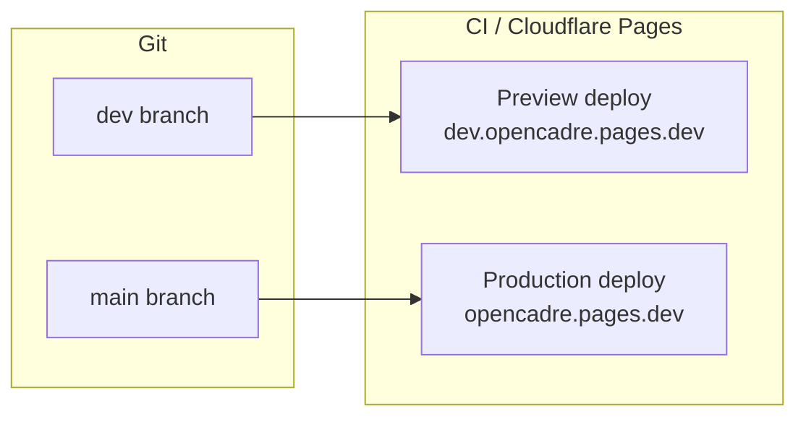

# OpenCadre — Project Tracking

This document describes the Git workflow, commit conventions, project history,
changelog, and roadmap for OpenCadre.

## 1. Git workflow

### Branches

| Branch | Purpose | Deployment |
| --- | --- | --- |
| `main` | Production-ready code | Cloudflare Pages production (https://opencadre.pages.dev) |
| `dev` | Active development | Cloudflare Pages preview (https://dev.opencadre.pages.dev) |

### Workflow

```text
1. Branch from dev:
   git checkout dev && git pull && git checkout -b feat/xyz

2. Work, commit (conventional commits), push.

3. Merge into dev when ready (or open a PR on GitHub).

4. When dev is stable and ready for production:
   git checkout main && git merge dev && git push
   (this triggers the production deploy)
```

The `dev` branch is the default development target. Feature branches merge
into `dev` first; `main` receives merges only when a release is ready for
production.

### Hooks and gates

- **pre-commit:** `pnpm run pre-commit` runs Biome lint + format on staged
  files.
- **commit-msg:** `pnpm run commitlint --edit $1` validates the commit message
  against the Conventional Commits specification. Non-conforming messages
  are rejected.
- **pre-push:** the Makefile target runs a full `pnpm build` to ensure every
  push to the remote is buildable.

---

## 2. Commit conventions

The project follows the **Conventional Commits** specification
(https://www.conventionalcommits.org/):

```text
<type>[optional scope]: <description>

[optional body]

[optional footer(s)]
```

### Allowed types

| Type | Use when |
| --- | --- |
| `feat` | Adding a new user-facing feature |
| `fix` | Fixing a bug or incorrect behavior |
| `refactor` | Restructuring code without changing behavior |
| `chore` | Tooling, config, dependency updates |
| `docs` | Documentation-only changes |
| `style` | Formatting, no logic change |
| `test` | Adding or updating tests |
| `perf` | Performance improvement |
| `ci` | CI/CD pipeline changes |
| `build` | Build system changes |

### Examples

```text
feat(kanban): implement drag-and-drop card reordering
fix(auth): handle expired refresh tokens gracefully
refactor(realtime): extract reconcile guard into shared utility
chore: update Supabase SDK to v2.49
docs: add architecture and database documentation
```

---

## 3. Development commands

| Command | Purpose |
| --- | --- |
| `pnpm install` | Install dependencies |
| `pnpm dev` | Start local Vite dev server |
| `pnpm build` | Production build (lint + typecheck + Vite bundle) |
| `pnpm typecheck` | TypeScript type checking only |
| `pnpm test:run` | Run Vitest unit tests (single run) |
| `pnpm test` | Start Vitest in watch mode |
| `pnpm deploy` | Build + deploy to Cloudflare Pages production |
| `make deploy-dev` | Build + deploy to Cloudflare Pages preview |

---

## 4. Supabase local development

The project includes a local Supabase stack for offline development:

```bash
make supabase-start     # Start Docker-based local stack
make supabase-stop      # Stop local stack
make supabase-restart   # Reset and restart
make supabase-db-reset  # Reset to a clean state
make supabase-rebuild   # Rebuild local containers
```

The local stack mirrors the remote schema, seed data, and RLS policies.

---

## 5. Deployment pipeline



| Trigger | Action |
| --- | --- |
| Push to `dev` | Cloudflare Pages builds and publishes a preview deployment |
| Push to `main` | Cloudflare Pages builds and publishes a production deployment |
| PR merged to `dev` or `main` | Automatic rebuild |

The build runs `pnpm build`, which includes Biome lint + format, TypeScript
type checking, and the Vite production bundle. The `dist/` output is served
directly by Cloudflare Pages.

---

## 6. Project history

The project was initialized on **2026-07-24** and has been developed over
several focused development sessions.

### Key milestones

| Date | Milestone |
| --- | --- |
| 2026-07-24 | Project initialization: SolidJS + Supabase + vanilla-extract + Biome |
| 2026-07-24 | Basic Supabase connection established; env and config scaffolded |
| 2026-08-01 | Biome configured for Zed Editor; font setup (Geist, Vercetti) |
| 2026-09-10 | Pre-push hook and setup documentation added |
| 2026-09-10 | Edge functions migrated to `withSupabase` pattern |
| 2026-09-11 | Demo links added; responsiveness improvements |
| 2026-09-11 | Deploy script added (`pnpm deploy`) |

### Commit statistics

- **Total commits (as of 2026-09-11):** 213
- **Commit range:** 2026-07-24 to 2026-09-11
- **Primary language:** TypeScript
- **Repository:** https://github.com/re1sub/opencadre

---

## 7. Roadmap

### Near-term (CCP evaluation closure)

| Phase | Items |
| --- | --- |
| Documentation | Requirements, architecture, API, database, project tracking (this doc) |
| Security | Output sanitization in Markdown editor, Content-Security-Policy headers, `.env.example` completeness |
| Error handling | Global `ErrorBoundary` for uncaught runtime errors |
| Component tests | SolidJS component unit tests (auth form, editable text, confirm dialog) |
| CI/CD | GitHub Actions pipeline for lint, typecheck, test, build, and Cloudflare Pages deploy |

### Medium-term

| Item | Description |
| --- | --- |
| Markdown table editing | Native table block inside the TipTap editor |
| Search | Full-text search across workspace pages |
| Profile avatars | User-uploaded avatars in `profiles.avatar_url` |
| `profiles` table triggers | `sync_profile_display_name` to stay in sync with auth metadata |
| Owner transfer | Transfer workspace ownership to another member |
| Export workspace | Full JSON/CSV export of workspace content |

### Long-term

| Item | Description |
| --- | --- |
| Real-time cursors | Show other users' cursors in collaborative editing |
| Multi-workspace subscriptions | Paid plans or usage limits per workspace |
| Mobile-optimized UI | Touch-optimized kanban and markdown editing |
| SSO / OAuth providers | Google, GitHub, or enterprise SSO sign-in |
| Audit log dashboard | Visual browser of `activity_logs` for workspace admins |